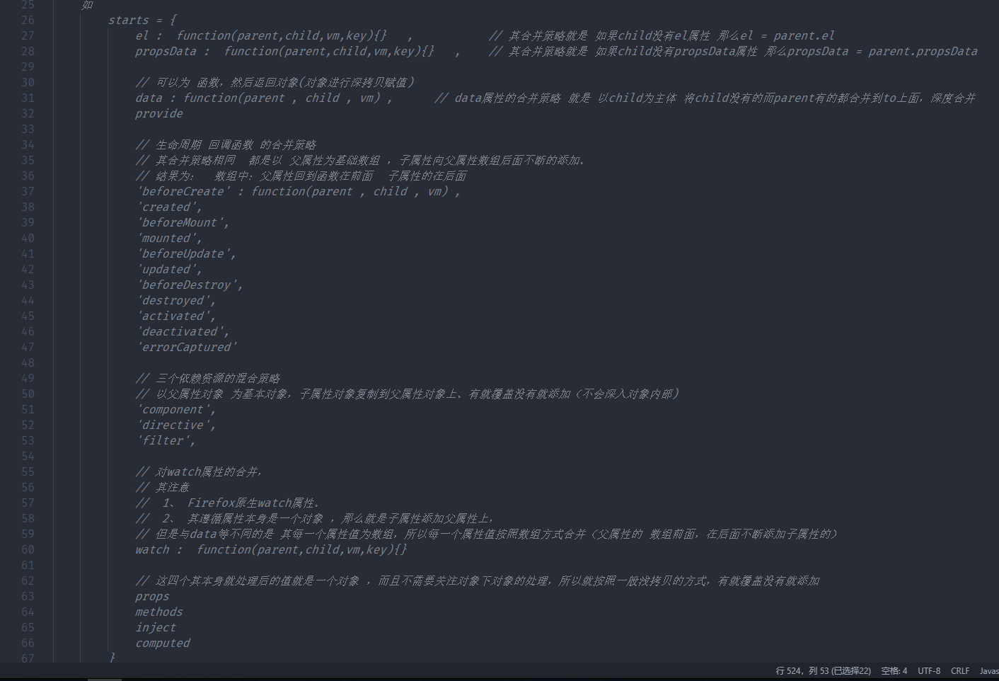

#  mergeOptions

> 处理 options 对象，主要通过 属性的驼峰命名处理、各属性的或者策略。

首先我们先看一下Vue option有哪些属性？

Vue
 ├── el
 ├── name
 ├── template
 ├── render
 ├── funtional
 ├── -------------
 ├── data
 ├── computed
 ├── props
 ├── methods
 ├── watch
 ├── inject
 ├── provide
 ├── -------------
 ├── directives
 ├── filters
 ├── components
 ├── mixins
 ├── extends
 ├── ----------------
 ├── beforeCreated
 ├── created
 ├── beforeMounted
 ├── mounted
 ├── beforeUpdate
 ├── updated
 ├── activated
 ├── beforeDestroyed
 └── destroyed
 
那我们定义一个组件的时候一般会这样使用

```js
export default {
    name : 'g2Button',
    directives:{
        focus: {
            // 指令的定义
            inserted: function (el) {
              el.focus()
            }
        }
    },
    filters : {
        capitalize: function (value) {
            if (!value) return ''
            value = value.toString()
            return value.charAt(0).toUpperCase() + value.slice(1)
        }
    },
    mixins:[{
        data(){ return { a : 1 } }
    },{
        data(){ return { a : 2 } }
    }],
    extends : {
        data(){ return { a : 3 }}
    },
    components:{ button  },

    data(){
        return {
            a : 4
        }
    }
}
```

这时候我们会发现 对于一个组件来说 其这些属性可以来源于这些方面：

- 组件本身定义的
- mixins 和 extends 混入的
- 全局的 其实就是  Vue.mixin() Vue.extend() Vue内部定义的一些。这些都存放在 Vue.options 上

那么这些属性如何merge成一个对象哪？ 同时如果相同的属性如何处理的？

#### 答案： 通过 mergeOptions 合并策略

其核心代码是：

```js
export function mergeOptions(
    parent     // 其实就是 Vue.options
    child:     // 用户定义的 配置属性
    vm         // 实例对象 
): Object {
    // 如果在开发环境 传入的components属性的参数
    // 我们 合并的时候  第一步 校验我们传入的 components 属性名称是否合法
    if (process.env.NODE_ENV !== 'production') {
        checkComponents(child)
    }

    // 判断合并的时候 child 不是对象 而是一个函数
    if (typeof child === 'function') {
        child = child.options
    }

    // 先处理props 转换成对象 并进行驼峰名称处理
    normalizeProps(child, vm)
    // 处理inject 
    normalizeInject(child, vm)
    // 处理directives
    normalizeDirectives(child)

    // 处理extends属性   合并属性 除了mixin还有extends属性
    //
    const extendsFrom = child.extends
    if (extendsFrom) {
        parent = mergeOptions(parent, extendsFrom, vm)
    }

    // 处理mixins
    // 对于 全局的或者组件内部的mixin 我们也可以在minxin内部去定义一个mixins 属性
    // 那么此时我们就需要去处理这个mixin属性
    if (child.mixins) {
        for (let i = 0, l = child.mixins.length; i < l; i++) {
            // 可见我们对于mixins属性  其应该为一个数组
            // { mixins: [ mixin1,mixin2 ... ]  }
            parent = mergeOptions(parent, child.mixins[i], vm)
        }
    }
    const options = {}
    let key
    for (key in parent) {
        mergeField(key)
    }
    for (key in child) {
        if (!hasOwn(parent, key)) {
            mergeField(key)
        }
    }
    // Vue可以通过Vue.config.optionMergeStrategies来自定义混合策略
    function mergeField(key) {
        // 如果用户自定义了混合策略 则使用自定义的 否则使用默认的
        const strat = strats[key] || defaultStrat
        // 使用混合策略去 混合生成 options
        options[key] = strat(parent[key], child[key], vm, key)
    }
    return options
}

```

##### 在聊上面的 mergeOptions 的一个功能，属性的驼峰命名处理 功能

```js
normalizeProps(child, vm)
// 处理inject 
normalizeInject(child, vm)
// 处理directives
normalizeDirectives(child)
```


这时候我们看 props 的处理方式

```js

/* 我们知道 props 的定义的方式 有两种方式 
 1. props : [ 'orderId' , 'name' ]
 2. props : {
    orderId : {
        type : [ Number],
        default : 123123 
    },
    name : String
 }

 那么 这个函数的功能是什么？ 

 1. 就是通过 camelize(val) 进行驼峰命名转换
 2. 将上面的多种定义方式 全部转换成一种
 即： props : {
    orderId : {
        type : props['orderId'].type || null,
        ...props['orderId']
    }
 }
*/
function normalizeProps(options: Object, vm: ? Component) {
    // 获取传入的 props 属性
    const props = options.props
    // 没有 返回
    if (!props) return
    const res = {}
    let i, val, name
    // 如果props是数组 就是上面的 第一种情况
    if (Array.isArray(props)) {
        i = props.length
        while (i--) {
            // 获取每一个属性值
            val = props[i]
            // 如果是字符串
            if (typeof val === 'string') {
                // 将字符串转换成驼峰命名的形式 my-props => myProps
                name = camelize(val)
                // 在 res 存储 属性
                res[name] = { type: null }
            } else if (process.env.NODE_ENV !== 'production') {
                warn('props must be strings when using array syntax.')
            }
        }
        // 如果是简单的对象
    } else if (isPlainObject(props)) {
        // 遍历对象
        for (const key in props) {
            val = props[key]
            // 驼峰命名转换
            name = camelize(key)
            // 判断是否是对象 
            res[name] = isPlainObject(val) ?
                val : { type: val }
        }
    } else if (process.env.NODE_ENV !== 'production') {
        warn(
            `Invalid value for option "props": expected an Array or an Object, ` +
            `but got ${toRawType(props)}.`,
            vm
        )
    }
    options.props = res
}
```

那么 normalizeInject 和 normalizeDirectives 功能一样。

1.  就是通过 camelize(val) 进行驼峰命名转换(directive不进行驼峰命名转换)
2.  inject 将数组和对象两种定义方式转换成 { key : { from : ... , ...}} , directives 将对象转换成 { bind: def, update: def } 这个格式

### 第二个问题 mixins 与 extends 属性的作用和区别

我们都知道 这两个都是进行 组件的属性混合的，那么他们的区别哪？

```js
export function mergeOptions(
    parent     // 其实就是 Vue.options
    child:     // 用户定义的 配置属性
    vm         // 实例对象 
): Object {
    // 处理extends属性   合并属性 除了mixin还有extends属性
    //
    const extendsFrom = child.extends
    if (extendsFrom) {
        parent = mergeOptions(parent, extendsFrom, vm)
    }

    // 处理mixins
    // 对于 全局的或者组件内部的mixin 我们也可以在minxin内部去定义一个mixins 属性
    // 那么此时我们就需要去处理这个mixin属性
    if (child.mixins) {
        for (let i = 0, l = child.mixins.length; i < l; i++) {
            // 可见我们对于mixins属性  其应该为一个数组
            // { mixins: [ mixin1,mixin2 ... ]  }
            parent = mergeOptions(parent, child.mixins[i], vm)
        }
    }
    return options
}

```
从上面的代码我们就知道 extends 与mixins的区别了。

1. extends 其值只能是一个对象，所以其只能混合一种配置对象 ，但是 mixins 的值是一个数组，那么其就可以混合多个 配置对象。

2. 其都是调用 mergeOptions 将其值跟 parent对象进行混合，但是 mixins 在 extends 后面执行，那么对于相同的属性那么 就是 mixins 覆盖 extends属性， mixins 后面的配置 覆盖前面的配置(注意： 覆盖只是对于那些 mergeOptions 合并策略是覆盖的属性，对于像 生命周期函数方法，就不是覆盖 而是 concat(),具体详见后面的)

### 下面就是mergeOptions的核心作用， **属性的合并策略**

```js
export function mergeOptions(
    parent     // 其实就是 Vue.options
    child:     // 用户定义的 配置属性
    vm         // 实例对象 
): Object {
    
    // 初始化一个对象 用于存放 合并后的值
    const options = {}

    // 先通过 合并策略合并 parent上的属性
    let key
    for (key in parent) {
        mergeField(key)
    }
    // 然后再 通过 合并策略合并 定义的属性
    for (key in child) {
        if (!hasOwn(parent, key)) {
            mergeField(key)
        }
    }
    // Vue可以通过Vue.config.optionMergeStrategies来自定义混合策略
    /*

     */
    function mergeField(key) {
        // 如果用户自定义了混合策略 则使用自定义的 否则使用默认的
        const strat = strats[key] || defaultStrat
        // 使用混合策略去 混合生成 options
        options[key] = strat(parent[key], child[key], vm, key)
    }
    return options
}

```


我们知道上面 已经对配置属性中的 name 、 props、inject、directives、mixins、extends 进行了处理。那么下面就进行 属性的合并

合并策略的核心方法就是

```js
function mergeField(key) {
    // 如果用户自定义了混合策略 则使用自定义的 否则使用默认的
    const strat = strats[key] || defaultStrat
    // 使用混合策略去 混合生成 options
    options[key] = strat(parent[key], child[key], vm, key)
}
```
其再初始化的时候 定义了一个 starts 对象。其值为

```js
starts = {
    data : (parent , child ,vm ,'data') => { return {} },
    computed : (parent , child ,vm ,'data') => { return {} },
    ...
}
```



或者是默认的合并策略 defaultStrat 即 child 覆盖 parent。

##### 下面我们简单的看几个 属性的合并策略

#### data 属性

```js

/**
 * Helper that recursively merges two data objects together.
 * 递归合并两个对象中的所有的属性
 *   以 to 为目标对象  from为源对象 将所有的to上没有而 from上存在的 合并到 to上面
 *   to = {  name : 'to' , obj : { key : 'to-key' }  }
 *   from = { obj : { key : 'from-key',value : 'from-value' } }
 *   结果为 to = { name : 'to' , obj : { key : 'to-key' , value : 'from-value'  } }
 */
function mergeData(to: Object, from: ? Object): Object {
    // 如果 目标对象不存在直接返回原对象
    if (!from) return to
    let key, toVal, fromVal
    // 
    const keys = Object.keys(from)
    for (let i = 0; i < keys.length; i++) {
        key = keys[i]
        toVal = to[key]
        fromVal = from[key]
        // 不是原型上的属性
        if (!hasOwn(to, key)) {
            // 在to对象上绑定或者更新属性，并触发双向绑定通知
            set(to, key, fromVal)
            // 如果仍然是对象 则继续向下遍历合并
        } else if (isPlainObject(toVal) && isPlainObject(fromVal)) {
            mergeData(toVal, fromVal)
        }
    }
    return to
}

/**
 * Data
 * 定义了 data/provide 的合并策略
 * 这两个属性的合并策略就是
 *  1、 都支持返回值为函数，但是函数的返回值要为 对象。就是最终结果都是对象的形式
 *  2、 通过mergeData() 定义了对象类型的 合并策略
 */
export function mergeDataOrFn(
    parentVal: any,
    childVal: any,
    vm ? : Component
): ? Function {
    if (!vm) {
        // in a Vue.extend merge, both should be functions
        // 如果 
        if (!childVal) {
            return parentVal
        }
        if (!parentVal) {
            return childVal
        }
        // when parentVal & childVal are both present,
        // we need to return a function that returns the
        // merged result of both functions... no need to
        // check if parentVal is a function here because
        // it has to be a function to pass previous merges.
        return function mergedDataFn() {
            return mergeData(
                typeof childVal === 'function' ? childVal.call(this, this) : childVal,
                typeof parentVal === 'function' ? parentVal.call(this, this) : parentVal
            )
        }
    } else {
        return function mergedInstanceDataFn() {
            // instance merge
            // 回调获取 子配置的结果对象
            // 因为data 和 provide 属性都支持返回值为function 类型 所以要执行call
            const instanceData = typeof childVal === 'function' ?
                childVal.call(vm, vm) :
                childVal
            const defaultData = typeof parentVal === 'function' ?
                parentVal.call(vm, vm) :
                parentVal
            //  以 childVal为主体将 parent上的值合并到childVal上
            if (instanceData) {
                return mergeData(instanceData, defaultData)
            } else {
                return defaultData
            }
        }
    }
}

// 定义了 data 属性的混合策略
strats.data = function(
    parentVal: any,
    childVal: any,
    vm ? : Component
): ? Function {
    if (!vm) {
        if (childVal && typeof childVal !== 'function') {
            process.env.NODE_ENV !== 'production' && warn(
                'The "data" option should be a function ' +
                'that returns a per-instance value in component ' +
                'definitions.',
                vm
            )

            return parentVal
        }
        return mergeDataOrFn(parentVal, childVal)
    }

    return mergeDataOrFn(parentVal, childVal, vm)
}

```
上面我们看 data 的合并策略，
首先我们知道 data 属性的定义方法：

1. data : {} 

2. data(){ return { } }  // 官方推荐

那么我们就是其就是调用 mergeDataOrFn 方法 然后判断 typeof childVal === 'function' ? childVal.call(vm, vm) : childVal 如果是 第二种 就调用childVal.call(vm, vm) 然后转换成 对象的形式。 最后调用mergeData 对 parent 与child对象 进行合并

我们看这一段代码

```js
// 不是原型上的属性
if (!hasOwn(to, key)) {
    // 在to对象上绑定或者更新属性，并触发双向绑定通知
    set(to, key, fromVal)
    // 如果仍然是对象 则继续向下遍历合并
} else if (isPlainObject(toVal) && isPlainObject(fromVal)) {
    mergeData(toVal, fromVal)
}
```

我们可以看到两个重点：

1. 其是一个深度合并的过程。

2. 通过 set(to, key, fromVal) 合并属性，并触发双向绑定的通知， 具体可见 ...


#### 生命周期属性的合并策略

```js
/**
 * 生命周期函数 的合并策略
 * @param parentVal   父配置文件
 * @param childVal    子配置对象
 * @returns {any}     返回的为一个数组
 */
function mergeHook(
    parentVal: ? Array < Function > ,
    childVal : ? Function | ? Array < Function >
) : ? Array < Function > {
    // 可见以父属性为基础数组 ，子属性向父属性数组后面不断的添加
    return childVal ?
        parentVal ?
        parentVal.concat(childVal) :
        Array.isArray(childVal) ?
        childVal : [childVal] : parentVal
}

/*
     定义了生命周期的 默认混合策略
    'beforeCreate' : function(parent , child , vm) ,
    'created',
    'beforeMount',
    'mounted',
    'beforeUpdate',
    'updated',
    'beforeDestroy',
    'destroyed',
    'activated',
    'deactivated',
    'errorCaptured'
 */
// strats.beforeCreate = function(parentVal,childVal){}  结果为 []   
LIFECYCLE_HOOKS.forEach(hook => {
    strats[hook] = mergeHook
})

```
从上面我们可以看出 生命周期方法的 合并策略跟 data 的合并策略不同，其不是合并的过程而是一个 concat 的过程

那么我们在

```js
{
    created(){ console.log(1); },
    mixins:[{
        created(){ console.log(2); }
    },{
        created(){ console.log(3); },
    }],
    extends:{
        created(){ console.log(4); },
    }
}
```
其结果就是

```js
created : [
    // 在 mergeOptions(parent, extendsFrom, vm) 现在parent上push了 extends 的 created
    created(){ console.log(4); },
    // 在 mergeOptions(parent, child.mixins[i], vm) 现在parent上按顺序 push了 mixins 的 created
    created(){ console.log(2); },
    created(){ console.log(3); },
    // 最后 在 mergeHook(parent , child ) push了 自身定义的 created
    created(){ console.log(1); },
]
// 即 执行结果 应该是 4,2,3,1
```

#### 对于 如 props、methods、inject、computed、watch  其不需要关注子属性 所以就是 浅拷贝的合并覆盖策略

#### 对于 'component','directive', 'filter' 三个属性的混合策略

```js
/**
 * 上面的解释就是  当我们创建一个组件实例的时候
 * 其依赖属性的值一般来至于5个方面。
 *   如 components :
 *      1、  Vue初始化的时候 Vue本身定义的3个组件  components : {  keepAlive ,Transition , TransitionGroup }
 *      2、  Vue.mixin() 全局合并的时候 如果存在components也会合并，但是Vue.mixin的原理也是将全局的合并到 Vue.options.components属性上
 *      3、  Vue.component() 的方式合并，同样 Vue.component()的原理也是将全局的合并到 Vue.options.components属性上。
 *
 *      4、  组件本身定义的extends、mixins两个属性
 *      5、  组件本身定义的components 属性
 *   其合并策略很简单  就是以父属性对象 为基本对象，子属性对象复制到父属性对象上。有就覆盖没有就添加（不会深入对象内部）
 *   其合并顺序也是  1 < (2 | 3 谁后谁大) < 4 < 5 大的覆盖小的
 * @param parentVal
 * @param childVal
 * @param vm
 */
function mergeAssets(
    parentVal: ? Object,
    childVal : ? Object,
    vm ? : Component,
    key : string
) : Object {
    // 以父属性为基础对象
    const res = Object.create(parentVal || null)
    if (childVal) {
        process.env.NODE_ENV !== 'production' && assertObjectType(key, childVal, vm)
        // 通过extend方式 合并 extend就是一个浅copy 将 childVal的属性复制到res上 （有就覆盖，没有就添加）
        return extend(res, childVal)
    } else {
        return res
    }
}

/*
  定义了 'component','directive', 'filter' 三个属性的混合策略
 */
ASSET_TYPES.forEach(function(type) {
    strats[type + 's'] = mergeAssets
})

```
这个也是 浅拷贝的合并覆盖策略，但是我们需要注意的是 我们有些时候 需要 components 去 申明一个组件。而很多时候我们直接使用 如 Vue.use(ElementUI) 我们直接使用 <el-button></el-button>

**这是为什么？**

上面我们也说过 mergeOptions 其parent 是 Vue[VueComponent].options 这个Vue构造函数上的静态属性 options。而我们一般 Vue.component(xx , xx) 其就是将这个组件保存在 Vue.options 上，那么这时候我们每一个组件初始化的时候就可以通过 extend(parnet, childVal) 将本身定义的 组件与 全局组件 合并保持在自身$options属性上。 